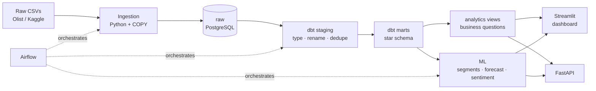

# End-to-End E-Commerce Analytics Pipeline

Raw e-commerce transaction data taken all the way from ingestion to business-ready
insight and a live dashboard: **ingest → store → transform → model → analyse →
visualise → deploy**, orchestrated by Airflow and tested at every layer.

Built on the [Brazilian E-Commerce Public Dataset by Olist](https://www.kaggle.com/datasets/olistbr/brazilian-ecommerce)
— ~100,000 real orders across nine relational CSVs.

```
Python · PostgreSQL · dbt · Apache Airflow · scikit-learn · Prophet · Streamlit · FastAPI · Docker
```

---

## Contents

- [What this actually does](#what-this-actually-does)
- [Architecture](#architecture)
- [Quickstart](#quickstart)
- [The data model](#the-data-model)
- [Data quality](#data-quality)
- [Orchestration](#orchestration)
- [Models](#models)
- [Findings](#findings)
- [Deploying the dashboard](#deploying-the-dashboard)
- [Repository layout](#repository-layout)
- [Testing](#testing)
- [Design decisions](#design-decisions-and-why)
- [What I would change for production](#what-i-would-change-for-production)

**Further reading:** [`docs/architecture.md`](docs/architecture.md) (system, star
schema and DAG diagrams, plus the layer contract) ·
[`docs/interview-notes.md`](docs/interview-notes.md) (the reasoning behind each
design decision, written out).

---

## What this actually does

| Stage | Implementation |
|---|---|
| **Ingest** | Kaggle API download → chunked `COPY` into a Postgres `raw` schema. Idempotent: upsert on natural keys, or atomic table swap where the source has none. |
| **Store** | Postgres with purpose-built schemas: `raw` → `staging` → `marts` → `analytics`, plus `ml` for model outputs and `meta` for the ingestion audit log. |
| **Transform** | dbt: 9 staging models, 2 intermediate, a 7-table star schema, 8 analytics views. **204 tests**, custom generic tests, generated docs. |
| **Orchestrate** | Airflow DAG — ingest → dbt build → dbt test → train → publish. Retries with exponential backoff, a resource pool for the memory-bound tasks, and an end-to-end idempotency guarantee. |
| **Model** | RFM segmentation (SQL) + KMeans clustering, Prophet revenue forecasting with a backtest, and a supervised Portuguese sentiment classifier. |
| **Visualise** | Six-page Streamlit dashboard on the mart layer, with a validated colour system. |
| **Serve** | FastAPI read-only service over the marts and model outputs. |
| **Ship** | `docker compose up` reproduces everything. GitHub Actions runs the full pipeline plus tests on every push. |

---

## Architecture



Every arrow is a real, tested boundary. The layering is deliberate: `raw` is a
faithful copy of the source so any transformation can be re-derived; all cleaning
happens in dbt where it is version-controlled and testable; the marts are the only
thing the dashboard and API are allowed to read.

---

## Quickstart

**Requirements:** Docker Desktop and ~6 GB free disk.

> **Memory.** The full stack — Postgres, the Airflow scheduler and webserver,
> Streamlit and FastAPI — wants around 4 GB, and the model-training step needs
> roughly another gigabyte on top while it fits. On a host with less than ~8 GB
> of RAM the ML tasks get OOM-killed and Docker itself can become unresponsive.
>
> Two mitigations ship in the box: the model tasks share a **one-slot Airflow
> pool** so they never run concurrently, and every service declares a
> `mem_limit` (tunable in `.env`) so the stack cannot starve the host.
>
> On a small machine, prefer the low-memory path, which stops the idle services
> for the duration of the run and restores them afterwards:
>
> ```bash
> ./scripts/run_pipeline_lite.sh
> ```

```bash
git clone <your-repo-url> && cd ecommerce-analytics-pipeline
cp .env.example .env
docker compose up -d --build
```

| Service | URL | Credentials |
|---|---|---|
| Dashboard | http://localhost:8501 | — |
| Airflow | http://localhost:8080 | `admin` / `admin` |
| API docs | http://localhost:8000/docs | — |
| Postgres | `localhost:5433` | `analytics` / `analytics` |

Then populate the warehouse. Either **trigger the DAG** from the Airflow UI (it
is unpaused and also runs daily at 04:00), or from the command line:

```bash
docker compose exec airflow-scheduler airflow dags trigger ecommerce_analytics_pipeline
```

To run the same steps without Airflow:

```bash
make pipeline
```

> `make` is not installed by default on Windows. The equivalent one-liner:
> ```bash
> docker compose run --rm --entrypoint bash airflow-scheduler -c 'set -e; cd /opt/airflow/project; (/home/airflow/venvs/pipeline/bin/python -m ingestion.cli download || /home/airflow/venvs/pipeline/bin/python -m ingestion.cli seed --synthetic --orders 20000); /home/airflow/venvs/pipeline/bin/python -m ingestion.cli load; /home/airflow/venvs/pipeline/bin/python -m ingestion.cli validate; cd dbt_project && /home/airflow/venvs/dbt/bin/dbt build --profiles-dir .; cd ..; /home/airflow/venvs/pipeline/bin/python -m ml.segmentation; /home/airflow/venvs/pipeline/bin/python -m ml.forecasting; /home/airflow/venvs/pipeline/bin/python -m ml.sentiment; /home/airflow/venvs/pipeline/bin/python -m scripts.export_snapshot'
> ```

`make help` lists every target.

### Getting the real data

The pipeline needs Kaggle credentials to fetch the real dataset:

1. Go to [kaggle.com/settings](https://www.kaggle.com/settings) → API → **Create New Token**.
2. Put `KAGGLE_USERNAME` and `KAGGLE_KEY` in your `.env` (or drop `kaggle.json` in `~/.kaggle/`).
3. `make download && make reload && make dbt-build && make ml`

**Without credentials the pipeline still runs end to end.** It falls back to
`ingestion/synthetic.py`, which generates a schema-compatible stand-in reproducing
the properties the downstream models depend on: a 25-month order history with growth
and weekly seasonality, a ~3% repeat-purchase rate, delivery delays correlated with
lower review scores, duplicate `review_id`s, and Portuguese review text. A provenance
marker records which path was taken, and `ingestion.cli info` reports it.

> The figures in [Findings](#findings) below were produced from the **synthetic**
> generator, because this repository is set up to run without credentials. They are
> shaped like the real results but are not the real results. Run `make download`
> first if you intend to quote numbers.

---

## The data model

A **star schema** — two fact tables at different grains, sharing conformed dimensions.

```
                       dim_date
                          │
  dim_customers ──── fact_orders ──── dim_geography
                          │
                  fact_order_items
                     │        │
             dim_products   dim_sellers
```

| Model | Grain | Notes |
|---|---|---|
| `fact_orders` | one row per order | Financial, payment, review and delivery measures. |
| `fact_order_items` | one row per item in an order | Anything sliced by product or seller. |
| `dim_customers` | one row per **person** | Keyed on `customer_unique_id`, not the source's per-order `customer_id`. |
| `dim_products` | one row per product | English category, weight class, chargeable shipping weight. |
| `dim_sellers` | one row per seller | Enriched with region and coordinates. |
| `dim_geography` | one row per zip prefix | Conformed — shared by customers and sellers. |
| `dim_date` | one row per day | Generated from the observed history, not hard-coded. |

**Why two facts rather than one wide table?** Orders and items are different grains.
Joining them flattens an order into one row per item, which multiplies every
order-level measure by the basket size. Keeping them separate means `order_total`
stays additive, and a dbt test asserts the two facts reconcile on revenue.

**Why is `dim_customers` at person grain?** Olist regenerates `customer_id` for every
order, so a dimension built on it would have one row per order — degenerate, and it
would make repeat-purchase and cohort analysis impossible. Resolving to
`customer_unique_id` is what makes the retention finding available at all.

---

## Data quality

**204 dbt tests** across three levels:

- **Schema tests** — `not_null`, `unique`, `relationships`, `accepted_values` on every key and enum.
- **Custom generic tests** in `dbt_project/macros/tests.sql` — `unique_combination_of_columns`,
  `expression_is_true`, `not_negative`, `equal_rowcount`, `sums_match`. Written by hand
  rather than pulled from `dbt_utils`, so the project builds with no package-registry access.
- **Singular tests** in `dbt_project/tests/` — cross-model business assertions:
  revenue reconciles between the two facts per order, lifecycle timestamps move
  forward, no orphan items, `dim_customers` order counts match the fact.

The load itself is guarded separately by `ingestion/validate.py` (row counts,
emptiness, natural-key uniqueness), because those failures are about the *load*, not
the model, and should fail earlier and more loudly.

Failing rows are persisted to a `dbt_test_failures` schema, so a red test points at
the offending records rather than just a count.

### Known source defects, handled explicitly

| Defect | Handling |
|---|---|
| `review_id` is not unique; some orders have several reviews | Preserved verbatim in `raw`; `stg_order_reviews` keeps the latest review per order. |
| `geolocation` has ~1M rows and no natural key | Collapsed to one centroid per zip prefix, after dropping coordinates outside Brazil. |
| ~2% of products have no category | Falls back to the Portuguese name, then `'unknown'` — revenue is never silently dropped. |
| Source column names misspell `length` as `lenght` | Preserved in `raw`, corrected in staging. |
| Zip prefixes lose leading zeros | Zero-padded in staging so geo joins line up. |

---

## Orchestration

`dags/ecommerce_analytics_pipeline.py` — daily at 04:00, `max_active_runs=1`.

```
start → ingest ─┬─ acquire_source_data
                ├─ load_raw_tables
                └─ validate_raw_zone
        → transform ─┬─ dbt_deps
                     ├─ dbt_run
                     ├─ dbt_test
                     └─ dbt_docs_generate
        → models ─┬─ customer_segmentation
                  ├─ revenue_forecast     (share a 1-slot pool)
                  └─ review_sentiment
        → export_dashboard_snapshot → finish
```

**Idempotency.** Any run can be repeated without duplicating data. Ingestion upserts
on natural keys or swaps tables atomically; dbt models are full rebuilds, so they are
functions of the raw zone rather than accumulations; ML outputs are replaced, not
appended. CI asserts this by running the whole pipeline twice and checking row counts
are unchanged.

**Failure handling.** Two retries with exponential backoff. `dbt test` is a separate
task from `dbt run` so a data-quality failure is visually distinct from a build
failure — and because it gates the ML tasks, models never train on data that failed
its tests. Docs generation uses `ALL_DONE`, because documentation is not worth failing
a data pipeline over.

**Resource pool.** The three model tasks are logically independent, but each holds a
full corpus in memory while fitting. Running them in parallel OOM-killed the scheduler
on a laptop, so they share a one-slot pool — still declared as independent tasks,
executed one at a time. Raise `ML_POOL_SLOTS` on a larger host.

---

## Models

### RFM segmentation + KMeans

`analytics.agg_customer_rfm` scores every customer on quintiles of Recency,
Frequency and Monetary value and maps them to named segments (Champions, At Risk,
Lost…). Frequency uses a fixed ladder rather than `ntile`, because this dataset's
frequency distribution is so compressed that quintiles collapse.

`ml/segmentation.py` is the unsupervised counterpart: KMeans over **log-scaled** RFM
features (monetary is long-tailed; without `log1p` the clusters just isolate outliers).
`k` is chosen by silhouette score over a candidate sweep, and the whole sweep is
written to `ml.segment_model_metrics` so the choice is auditable. Clusters are named
from where their centroid sits *relative to the others*, not from their index — KMeans
ids reshuffle between runs, so index-based names would change meaning on every rebuild.

### Revenue forecasting

`ml/forecasting.py` fits Prophet on daily revenue, and does two things a tutorial
would skip:

- **A holdout.** The last 90 days are withheld; MAPE/RMSE are reported on data the
  model never saw. A forecast without a backtest is decoration.
- **A baseline.** A seasonal-naive forecast is scored on the same holdout. If Prophet
  could not beat it, that would be the finding — and it would be recorded, not hidden.

It also trims trailing partial days before fitting. The Olist extract stops
mid-collection, and leaving those days in teaches the model a downtrend that is an
artefact of the export rather than the business.

### Review sentiment

The obvious move is an off-the-shelf lexicon like VADER. That would be **wrong**:
Olist's reviews are in Portuguese and VADER's lexicon is English, so it would score
most of the corpus as neutral and look plausible while being meaningless.

`ml/sentiment.py` trains on the corpus itself instead — TF-IDF over word *and*
character n-grams (character n-grams recover Portuguese inflections that word n-grams
treat as unrelated), with logistic regression, using star ratings as weak labels.
3-star reviews are dropped from training as genuinely ambiguous. Accents are folded so
"não" and "nao" are one feature. The learned coefficients are written out, because the
driver terms are the part a stakeholder actually cares about.

The module warns loudly if holdout ROC-AUC exceeds 0.995 — for free text that almost
always means leakage, not a good model.

---

## Findings

> Produced from the synthetic generator (see [Quickstart](#quickstart)). The
> methodology is what matters here; re-run with the real dataset for real numbers.

**1. Late delivery is the dominant driver of dissatisfaction — worth about 2 stars.**

| Delivery vs. promise | Orders | Avg review | 1-star rate |
|---|---:|---:|---:|
| 10+ days early | 13,026 | 4.32 | 6.1% |
| 1–9 days early | 5,007 | 4.35 | 5.5% |
| On the promise date | 212 | 3.31 | 26.4% |
| 1–3 days late | 452 | 2.27 | 45.4% |
| 4–7 days late | 286 | 2.32 | 42.3% |
| 8–14 days late | 119 | 2.22 | 47.9% |
| 15+ days late | 24 | 2.46 | 45.8% |

The relationship is monotonic and the drop is a cliff, not a slope: missing the
promise date *at all* roughly doubles the 1-star rate. Correlation between days-late
and review score is **−0.194**. The independent corroboration is that the sentiment
classifier's most negative learned terms are delivery words, not product words —
customers complain about *when* it arrived, not *what* arrived.

**Business action:** the promise date is the lever, not the delivery time. Padding
estimated delivery dates costs nothing and moves orders from "late" into "early",
where satisfaction is already high. That is far cheaper than accelerating logistics.

**2. Repeat purchase is structurally near zero (~3%).**

Cohort retention is flat within one month of acquisition. This is a real property of
the business, not a modelling artefact — Olist is a transactional marketplace, not a
subscription. **Business action:** retention campaigns would chase a customer base
that does not return; the leverage is in acquisition efficiency and in first-order
experience, which loops straight back to finding 1.

**3. Distance drives freight cost, delivery time and satisfaction together.**

Northern and North-Eastern states pay materially more freight as a share of goods
value, wait longer, and score lower. Geography is the upstream cause of the
satisfaction gap. **Business action:** regional fulfilment capacity, not a nationwide
discount.

**4. Revenue is concentrated but not fragile.** The top 10 of 26 categories carry
~67% of revenue with no single category above ~11% — which argues for category-level
merchandising rather than a single-category bet.

---

## Deploying the dashboard

Streamlit Community Cloud cannot reach a Postgres running in Docker on a laptop.
Rather than exposing the warehouse to the internet, the pipeline publishes a read-only
Parquet snapshot (`scripts/export_snapshot.py`), and the dashboard picks its backend
at runtime:

- `DATABASE_URL` set and reachable → **live warehouse** (local development)
- otherwise → **Parquet snapshot** in `dashboard/data/` (deployed)

Both paths return identical DataFrames, so there is one set of dashboard code and no
risk of the two showing different numbers. The connection is *probed*, not assumed —
a `DATABASE_URL` pointing at a stopped container degrades to the snapshot rather than
crashing the app.

Customer-level and item-level tables are deliberately excluded from the snapshot: no
view needs them at row grain, and publishing per-customer rows to a public host would
be the wrong default. A test enforces this.

**To deploy:** run `make snapshot` (or the DAG, which does it as its last step),
commit `dashboard/data/*.parquet` — ~260 KB, and deliberately *not* gitignored,
because it is the deploy artifact — then on
[share.streamlit.io](https://share.streamlit.io) point at `dashboard/Overview.py`.
The root `requirements.txt` is the deploy manifest and contains only what the
snapshot path needs: no database driver, no dbt, no ML libraries.

---

## Repository layout

```
ecommerce-analytics-pipeline/
├── ingestion/              # Kaggle download, synthetic generator, idempotent loader
│   ├── schemas.py          #   declarative spec for all 9 source tables
│   ├── load.py             #   COPY → staging → upsert / atomic swap
│   ├── synthetic.py        #   schema-compatible stand-in dataset
│   └── validate.py         #   raw-zone checks
├── dags/                   # Airflow DAG
├── dbt_project/
│   ├── models/staging/     #   typing, renaming, de-duplication
│   ├── models/intermediate/#   pre-aggregations that prevent fan-out
│   ├── models/marts/core/  #   star schema
│   ├── models/marts/analytics/  # business-question views
│   ├── macros/             #   custom generic tests + shared business rules
│   └── tests/              #   singular cross-model assertions
├── ml/                     # segmentation, forecasting, sentiment
├── api/                    # FastAPI read-only service
├── dashboard/              # Streamlit app (Overview.py + pages/)
├── scripts/                # snapshot exporter
├── tests/                  # pytest: unit + integration
├── docker/                 # images and Postgres bootstrap
├── docker-compose.yml
└── Makefile
```

---

## Testing

```bash
make test               # unit tests, no database needed
make test-integration   # against the running warehouse
make dbt-test           # 204 dbt data tests
make lint               # ruff
```

- **Unit** — table specs, generated SQL, type coercion (a bad value must become `NULL`
  rather than abort a `COPY`), text normalisation, cluster labelling, forecast metrics,
  and the synthetic generator's statistical properties.
- **Integration** — asserts what dbt cannot: that re-running the loader does not change
  row counts, that the two facts reconcile on revenue, that dimensions are unique, and
  that `dim_customers` is not degenerate.
- **CI** (`.github/workflows/ci.yml`) — lint, unit tests, DAG import check, and the full
  pipeline against a Postgres service container, ending with an explicit
  **idempotency check** that runs everything twice and compares row counts.

---

## Design decisions (and why)

**Why dbt instead of pandas?** Transformations run *in* the warehouse rather than
pulling data out to a Python process, so they scale with the database rather than with
laptop memory. More importantly, dbt gives lineage, tests and docs as first-class
artefacts — with pandas the transformation logic, its documentation and its tests are
three separate things that drift apart.

**Why a star schema over snowflake?** Snowflaking would normalise `dim_products` into
product → category → category-translation. That saves storage this project does not
need and costs a join on every query. Star keeps analytical SQL flat and readable.
The one place normalisation *is* kept is `dim_geography`, because customers and sellers
genuinely share it — that is a conformed dimension, not a snowflake.

**Why is the raw zone a faithful copy?** Cleaning during load would mean the only
record of what the source actually said is gone. Loading verbatim and cleaning in dbt
means every transformation is version-controlled, testable, and reversible.

**Why two virtualenvs in the Airflow image?** dbt and the scientific stack disagree on
transitive pins often enough that sharing an interpreter with Airflow's scheduler is a
real risk. Each gets its own venv; the DAG shells into them. A pin bump in dbt cannot
take down the orchestrator.

**Why fixed chart colours?** Categorical hues are assigned by slot and never cycled, so
a series keeps its colour when a filter changes how many series are on screen. The
palette was checked for colourblind separation and contrast against the app's surface;
where a slot sits below 3:1, the chart ships direct labels or an accompanying table.

---

## What I would change for production

This is a static historical snapshot, and the design is honest about that. For live
data:

- **Incremental models.** dbt `incremental` materialisation with a
  `unique_key` and a lookback window on `order_purchase_timestamp`, instead of full
  rebuilds — the current approach is correct but rebuilds everything each run.
- **Partitioned facts.** Monthly range partitions on `fact_orders` so a backfill can
  drop and rebuild a single partition rather than the whole table.
- **Real backfills.** The DAG deliberately does not partition writes by execution date,
  which is right for a fixed snapshot. Streaming data would need
  data-interval-scoped loads and `catchup=True`.
- **Snapshots for slowly-changing dimensions.** Product prices and seller details
  change; `dbt snapshot` would preserve history instead of overwriting.
- **Streaming.** For near-real-time, orders would land on Kafka, a consumer would
  write to a staging table, and dbt would run on a micro-batch schedule. The star
  schema and the tests would not need to change — which is rather the point of the
  layering.
- **Freshness and alerting.** `dbt source freshness` plus alerting on test failures,
  rather than relying on someone looking at the Airflow UI.

---

## Licence and attribution

Dataset: [Brazilian E-Commerce Public Dataset by Olist](https://www.kaggle.com/datasets/olistbr/brazilian-ecommerce),
published on Kaggle under CC BY-NC-SA 4.0. Pipeline code in this repository is MIT.
