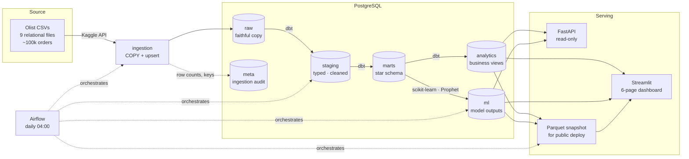
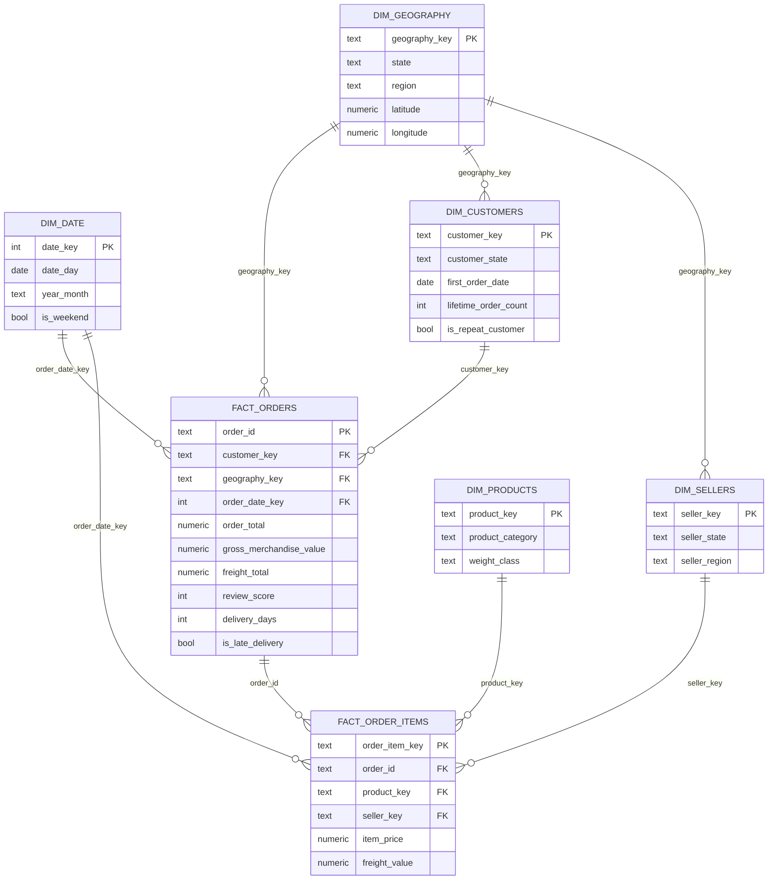
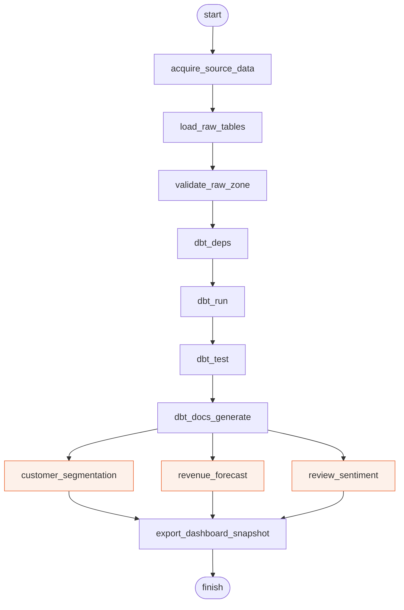

# Architecture

Diagrams are Mermaid rather than a checked-in PNG: GitHub renders them inline,
and a diagram that lives next to the code it describes stays correct when the
code changes. A PNG goes stale silently.

## System

## Star schema

## Airflow DAG

The three highlighted tasks share a one-slot Airflow pool. They have no data
dependency on each other, but each holds a full corpus in memory while fitting,
and running them concurrently OOM-killed the scheduler on a laptop-sized host.

## Layer contract

| Layer | Written by | May be read by | Guarantee |
|---|---|---|---|
| `raw` | `ingestion/` | dbt staging only | Byte-faithful to the source; never cleaned |
| `staging` | dbt | dbt marts only | Typed, renamed, de-duplicated |
| `marts` | dbt | analytics, ML, API | Star schema; tested grain and referential integrity |
| `analytics` | dbt | dashboard, API, snapshot | One definition per business metric |
| `ml` | `ml/` | dashboard, API, snapshot | Fully replaced each run; stamped with `run_id` |
| `meta` | `ingestion/` | operators | Append-only ingestion audit trail |

The dashboard and API are only ever allowed to read `analytics` and `ml`. That
is what keeps a metric definition from being reimplemented — differently — in
the presentation layer.
